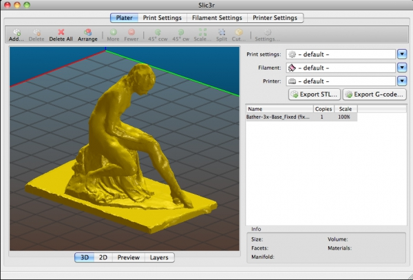

Slic3r is the tool you need to **convert a 3D model into printing instructions for your 3D printer**. It cuts the model into horizontal slices (**layers**), generates toolpaths to fill them and calculates the amount of material to be extruded.

The Slic3r project was born in 2011 within the [RepRap](http://reprap.org/) community as an effort to provide the growing 3D printing technology with an **open and flexible toolchain**. The code and the algorithms are not based on any other previous work. **Readability** and **maintainability of the code** are among the design goals. Slic3r, being a true **non-profit community project**, allowed the people to experiment with several **original new features** that have become common thereafter such as **multiple extruders, brim, microlayering, bridge detection, command line slicing, variable layer heights, sequential printing** (one object at time), **honeycomb infill, mesh cutting, object splitting into parts, AMF support**, avoid crossing perimeters, distinct extrusion widths, modifiers, and much more. All of these features were first introduced in Slic3r and are now part of the commercial software out there.

Slic3r is based on a **community of people working collaboratively** on [GitHub](https://github.com/slic3r/Slic3r), discussing new features and testing them. It's being used by tens of thousands of people all over the world, and there are more than 1,000 forks of it. It's a non-profit project. 3D printing became a business since the RepRap community was born, but **we want to keep 3D printing free**, and Slic3r will always be an **independent project**, not driven by any business or single vendor. Support is appreciated, though.

Slic3r was part of the **Google Summer of Code** program 2017.

Oh, and we don't like marketing buzzwords. ;-)

Slic3r is:

* **Open:** it is totally open source and it's independent from any commercial company or printer manufacturer. We want to keep 3D printing open and free.
* **Compatible:** it supports all the known G-code dialects (Marlin, Repetier, Mach3, LinuxCNC, Machinekit, Smoothie, Makerware, Sailfish).
* **Advanced:** many configuration options allow for fine-tuning and full control. While novice users often need just few options, Slic3r is mostly used by advanced users.
* **Community-driven:** new features or issues are discussed in the GitHub repository. Join our collaborative effort and help improve it!
* **Robust:** the codebase includes more than 1,000 unit and regression tests, collected in 6 years of development.
* **Modular:** the core of Slic3r is libslic3r, a C++ library that provides a granular API and reusable components.
* **Embeddable:** a complete and powerful command line interface allows to use Slic3r from the shell or to integrate it in server-side applications.
* **Powerful:** see the list below!
 

## Features

(Most of these are also available in the command line interface.)

* **G-code generation** for FFF/FDM printers;
* **conversion** between STL, OBJ, AMF and POV formats;
* **auto-repair** of non-manifold meshes (and ability to re-export them);
* **SVG export** of slices;
* built-in **USB/serial host controller**, supporting multiple simultaneous printers each one with a spool queue;
* **OctoPrint** integration (send to printer);
* built-in **projector and host for DLP printers**;
* tool for **cutting meshes** in multiple solid parts with visual preview (also in batch using a grid);
* tool for extruding 2.5D TIN meshes.
