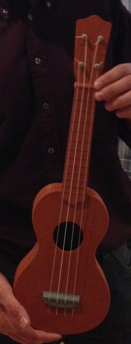
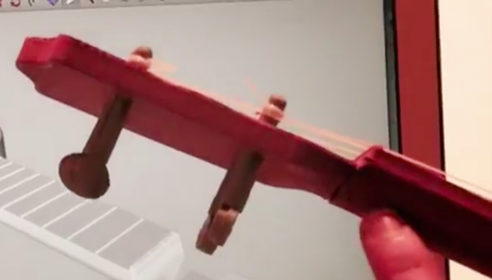
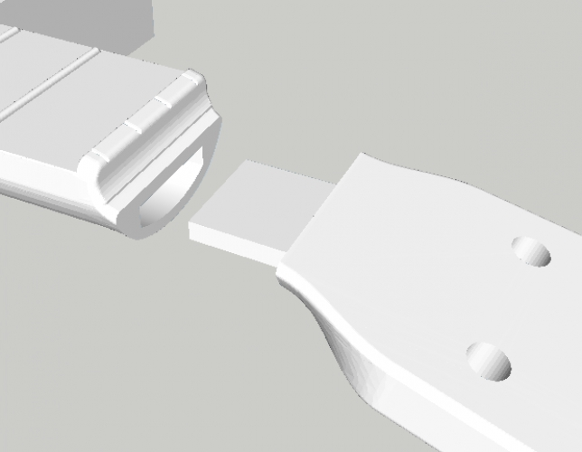
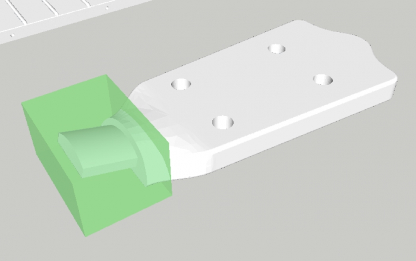
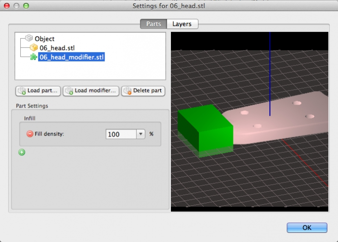
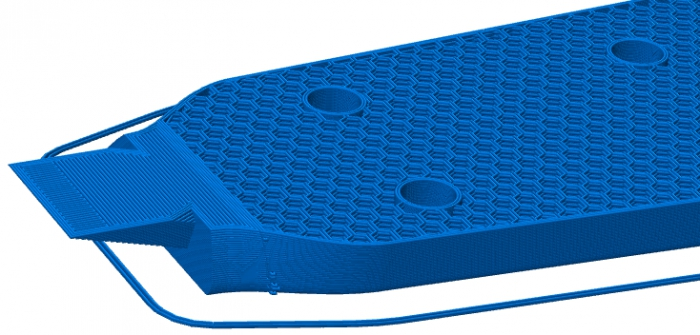
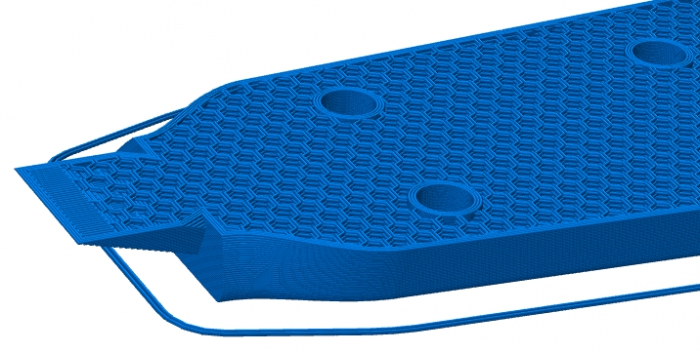

We'll go through one of the most advanced features of Slic3r: the ability to use **modifier meshes** for applying **distinct settings to object parts**. Infact Slic3r allows users to define regions where the print settings should be overridden by distinct settings.

Some time ago I decided to design an [ukulele](https://www.thingiverse.com/thing:199298) that could be printed on a RepRap. I also called [JonTom](http://www.jontom.net), a world-famous ukulele player for getting a review of it. You might want to enjoy the [YouTube video](https://www.youtube.com/watch?v=Zw4zUevnqRQ) about it.

Before assembling it, I was worried that string tension would break the instrument or bend it too much. Nothing happened to the instrument body and neck. However, the head got bent a bit too much. This is how it should have been:

And this is how it turned out after tensioning strings:

The joint I designed turned out to be too flexible:

So, at this point there would have been three possible solutions:

*   redesign the parts with a larger joint (not much possible without altering the external shape of the instrument)
*   print the head with 100% solid infill
*   **print just the joint area with 100% solid infill**

I chose the third option: let's see how this feature works.

I used my CAD application to model a simple volume around the area that I wanted to print with solid infill:

Then I exported it as a separate STL file.

Finally, I fired Slic3r up and loaded the main part, then clicked on _Settings..._ and then hit _Load modifier..._ I loaded the new volume as a modifier mesh and I applied 100% solid infill to it:

That's it!

This is the comparison between a print with the modifier and without modifier. Note the solid area near the joint:

Modifiers are a different way for specifying multi-part objects: instead of importing multiple volumes that define the object shape, you can import a special volume that overlaps with the object and defines a part by subtracting it from the rest of the object.
