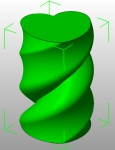
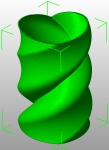

The _**Top solid layers**_ option in Slic3r allows to print vases from simple solid models. This means that you don't need to hollow out your models manually, which can be a timeconsuming task and often requires features that basic modeling packages don't offer.

The trick is just to set _**Top solid layers**_ to 0 and _**Infill density**_ to 0 - voila, your solid will be printed with just its sides and the bottom surface.

You can then use the _**Bottom solid layers**_ and _**Perimeters**_ options to define the thickness of the bottom and the walls of your vase (note that this allows to change such thickness at print time without having to change it in the original model).

This trick also enables **faster slicing**, because Slic3r won't need to use its thinwall/medial axis algorithm to collapse the walls into single traces.

So, when you find that sexy vase on Thingiverse be sure to check whether a solid version is available - if so, use that instead of the one that is already hollowed out (for example, the [Twisted Heart Vase](http://www.thingiverse.com/thing:42570) provides both). If not, you can use a tool like [Meshlab](http://meshlab.sourceforge.net/) or [Netfabb Studio Basic](http://www.netfabb.com/download.php) to fill the holes like I did for the [Tornado](http://www.thingiverse.com/thing:33344).

 

If you ever decide to print a single-walled vase (i.e. with _Perimeters_ set to 1) you can also benefit from the **_Spiral Vase_** setting which will raise Z continuously avoiding a layer-change point which would cause a visible seam. This setting works with any number of bottom solid layers.
